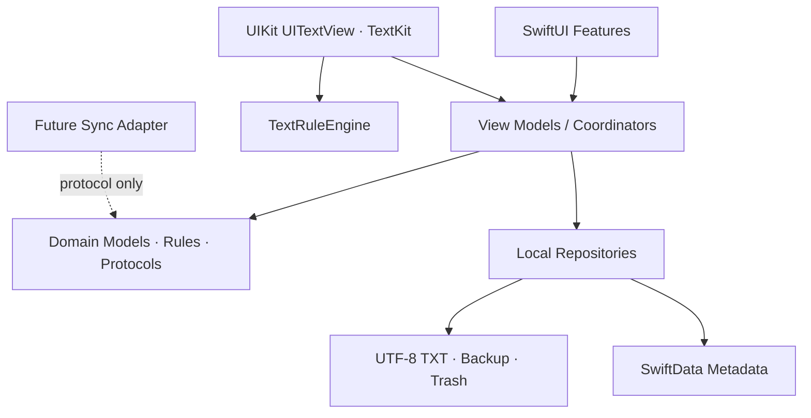

# 목표 아키텍처 — 로컬 1~7단계

## 설계 목표

WriterPad는 iPad에서 인터넷 없이 집필할 수 있는 로컬 우선 앱이다. 원고 본문은 UTF-8 TXT가 단일 원본이고 SwiftData는 UUID, 경로, 정렬, 화면 상태 같은 메타데이터만 보관한다. 화면은 저장 구현을 직접 호출하지 않고 도메인 서비스와 저장소 경계를 통해 작업한다.

## 계층

의존 방향은 위에서 아래로만 흐른다. Domain은 SwiftUI, UIKit, SwiftData, 파일 시스템, Supabase를 import하지 않는다.

## 단일 원본과 저장 흐름

1. 편집기가 현재 텍스트 스냅샷과 generation을 저장 coordinator에 전달한다.
2. `LocalDocumentStore` actor가 동일 문서 저장을 직렬화한다.
3. 같은 디렉터리에 고유 임시 파일을 쓴다.
4. UTF-8 바이트 쓰기와 가능한 flush를 마친 뒤 원본을 안전하게 교체한다.
5. 성공한 바이트에서 SHA-256을 계산한다.
6. SwiftData의 경로·해시·수정 시각을 갱신한다.
7. 필요하면 백업 사건을 요청한다.
8. 향후 동기화 adapter에는 사건을 전달할 수 있지만 1~7단계에서는 no-op이다.

SwiftData 갱신에 실패하더라도 TXT 원고를 되돌려 잃게 만들지 않는다. 원고 교체 전에 저장한 재조정 표식과 실제 TXT SHA-256가 일치할 때만 다음 실행에서 메타데이터를 반영한다.

## 문서 정체성과 경로

- `project_id`와 `document_id`는 생성 후 바뀌지 않는다.
- 상대 경로는 파일의 현재 위치다.
- 이름 변경, 이동, 휴지통 이동 시 ID는 유지하고 경로·부모만 변경한다.
- 원고는 `원고/N권/NNN화.txt` 규칙을 사용한다.
- 플롯과 메인 스토리 틀은 시스템 고정 항목이 아니다.
- Windows 호환 휴지통 경로는 `메인/휴지통`이다.

## 편집기

- SwiftUI는 화면 조합과 상태 표시를 담당한다.
- `iPadTextEditor`가 `UITextView`를 SwiftUI에 연결한다.
- `SmartTextView`는 키 입력과 명령의 UIKit 접점을 담당한다.
- `TextRuleEngine`은 UIKit과 분리된 순수 Swift 규칙 엔진이다.
- IME 조합 중에는 본문 재주입과 즉시 문서 교체를 금지한다.
- 자동 저장, 백업, 검색은 editor subclass 내부에 구현하지 않는다.

## 바인더

고정 최상위 항목은 원고, 캐릭터, 설정집, 메모장, 흐름 정리, 복선, 장소, 휴지통 8개다. `BinderRuleService`는 원고 전용 제약만 판정하고 일반 문서 영역은 안전한 파일명 규칙 안에서 사용자 폴더 생성을 허용한다.

화면의 최상위 `휴지통`은 디스크의 `메인/휴지통`에 매핑한다. Windows 구형 작품의 `메인/플롯`과 `백업/전환직전`은 가져오기 중 삭제하거나 다른 폴더와 합치지 않고 레거시 사용자 자료로 보존한다.

## 실패 복구

- 파일 작업은 임시 경로와 승격 또는 복구 저널을 사용한다.
- 작품 생성, 가져오기, 새 권 생성은 전부 성공 또는 전부 롤백한다.
- 저장 실패 시 마지막 정상 TXT와 메모리 스냅샷 중 최소 하나가 남아야 한다.
- 복원 전 현재본을 강제 백업한다.
- 이름 충돌은 덮어쓰지 않는다.

## 후속 서버 연결 경계

1~7단계에서는 Supabase 패키지, 인증, SQL, RPC, 서버 payload를 만들지 않는다. Domain/Protocols에 로컬 저장 완료, 구조 변경, 복원, 삭제 같은 사건을 향후 adapter에 전달할 수 있는 최소 인터페이스만 둔다. 현재 구현은 no-op이며 로컬 성공 여부에 영향을 주지 않는다.
