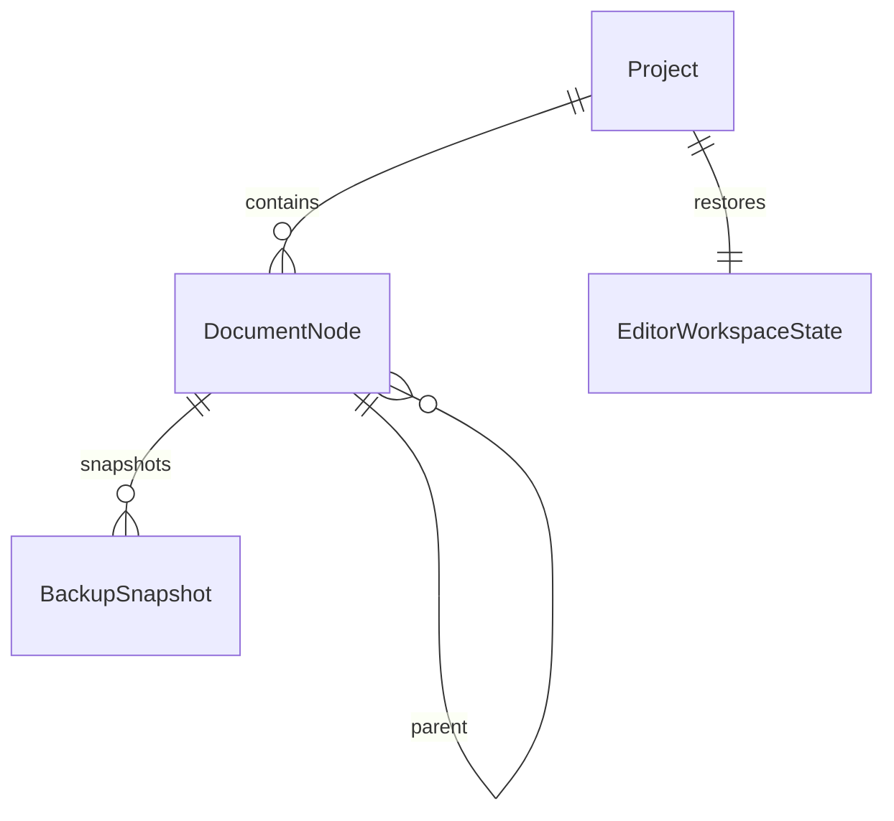

# 1-3 도메인 모델과 저장 경계

## 핵심 관계

`ProjectID`, `DocumentID`, `BackupID`는 모두 UUID를 감싸지만 서로 대입할 수 없는 별도 타입이다. 파일이나 폴더의 현재 위치는 `RelativeDocumentPath`이며 식별자로 사용하지 않는다.

## 모델 책임

| 모델 | 저장하는 정보 | 저장하지 않는 정보 |
|---|---|---|
| `Project` | 작품 UUID, 이름, 생성·수정 시각 | 서버 revision, 원고 본문 |
| `ManagedProject` | Project, 사용자 순서, 활성·삭제 대기 상태 | 원고 본문, 실제 휴지통 처리 |
| `DocumentNode` | 문서 UUID, 작품 UUID, 종류, 부모, 상대 경로, 순서, 수정 시각, SHA-256, 삭제·커서·펼침 상태 | TXT 본문 |
| `BackupSnapshot` | 백업 UUID, 연결된 작품·문서 UUID, 백업 위치, 시각, 해시, 생성 이유, 보관 여부 | 백업 본문 자체 |
| `EditorWorkspaceState` | 좌우 문서, 각 커서, 활성 편집기 | UIKit 객체·NSRange |
| `SaveState` | 편집·저장 중·저장됨·실패와 generation | 파일 내용·서버 상태 |

`DocumentNode.relocated`와 `movedToTrash`는 상대 경로와 부모·삭제 상태만 바꾸고 `document_id`, `project_id`를 유지한다. 휴지통 상태에는 복원용 원래 상대 경로가 남는다.

## 저장 경계

- `ProjectRepository`: 작품 메타데이터
- `ProjectManaging`: 작품 폴더·메타데이터를 함께 다루는 생성·이름 변경·순서·삭제 확인 거래
- `DocumentRepository`: 문서 메타데이터
- `LocalDocumentStoring`: UTF-8 TXT 읽기와 원자 저장
- `BackupStoring`: 백업 생성·조회·복원
- `Searching`: 프로젝트 TXT 검색
- `Exporting`: 소장용 UTF-8 TXT·PDF 원고 내보내기
- `AppClock`, `UUIDGenerating`, `ContentHashing`: 시간·UUID·SHA-256 교체 지점

본문 문자열은 Codable 메타데이터에 존재하지 않는다. 파일 저장 때만 Codable이 아닌 `DocumentSaveRequest`에 일시적으로 담긴다.

## 후속 동기화 경계

`FutureSyncMode`는 `unconfigured`, `localOnly`, `futureConnection`만 표현한다. 로컬 사건에는 안정적인 작품·문서 ID와 content hash 확장점이 있지만 서버 revision, metadata revision, operation payload는 정의하지 않았다.

## SwiftData 연결

1-4에서 이 순수 모델을 SwiftData V1 메타데이터 레코드로 연결했다. 변환과 무결성 검사는 `SwiftDataMetadataRepository` actor 안에서 수행하며 TXT 본문은 스키마에 포함하지 않는다.
